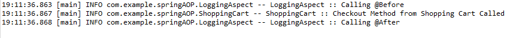

### Spring Boot Demo 8 Aspect Oriented Programming (AOP) Example (@Before and @After with Logging)

**Steps:**
<ol>
<li>To setup IDE for Spring project, follow steps in https://github.com/worldpeacez0991/SpringBoot_demo1</li>

 

<li>Start Spring Boot App
<ul>
<li>Via Spring IDE, open 'DemoApplication.java', press 'Alt+Shift+X, B', to start 'Spring Boot App' 
This shows how to use Aspect Oriented Programming (AOP) in a Spring Boot Application</li> 
<li>Via console logs, check if AspectJ Logs are printing as follows:</li>
<kbd></kbd>  
</ul>
</li>

 
Credits: https://spring.io/team 
Source: https://docs.spring.io/spring-framework/reference/core/aop.html 
Source: https://websparrow.org/spring/spring-aop-aspectj-pointcut-annotation-example#:~:text=Spring%20provides%20the%20%40Pointcut%20annotation%20to%20declare%20a,private%20void%20anyOldTransfer%20%28%29%20%7B%7D%2F%2F%20the%20pointcut%20signature 
Source: https://www.geeksforgeeks.org/usage-of-before-after-around-afterreturning-and-afterthrowing-in-a-single-spring-aop-project/ 
Source: https://www.youtube.com/watch?v=xdl1b97GANk 
Source: https://www.baeldung.com/spring-aop-advice-tutorial 
Source: https://howtodoinjava.com/spring-boot2/aop-aspectj/ 

